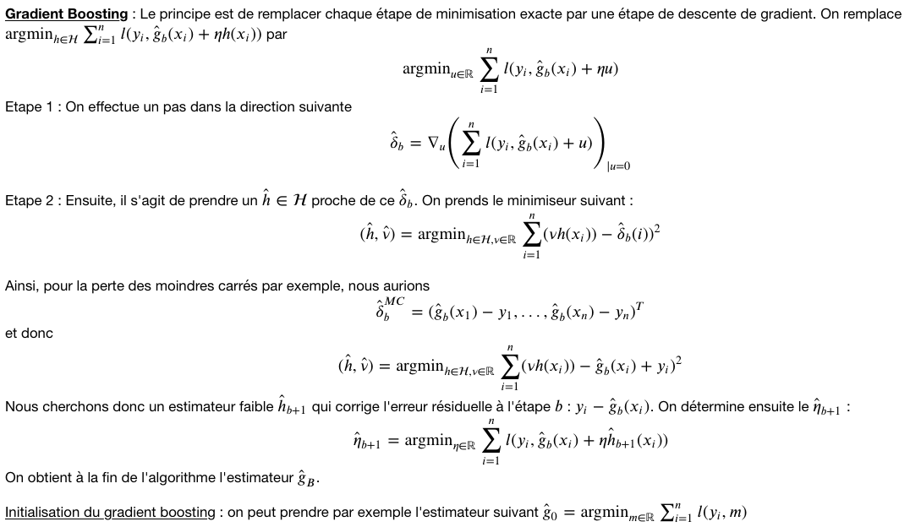
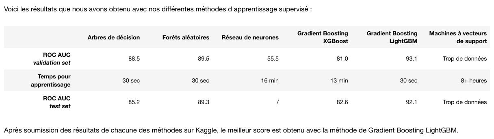

# Group project : Machine Learning for fraud detection (dans le cadre du M2)

Theoretical presentation of various ML methods and application to the Kaggle competition for fraud detection (https://www.kaggle.com/c/ieee-fraud-detection/data).

## Keywords

Binary classification, Unbalanced data, Decision Tree, Random Forest, Neural Networks, Gradient Boosting (LightGBM, XGBoost), SVM, Missing values, Under-sampling, Over-sampling.

## Fichiers
 • ieee_fraud_detection_project : project report python notebook (.ipynb)
 
 • ieee_fraud_detection_project.html : project report (html)
  
 • images folder : images of the html file

Voici les résultats obtenus avec les différentes méthodes utilisées :

